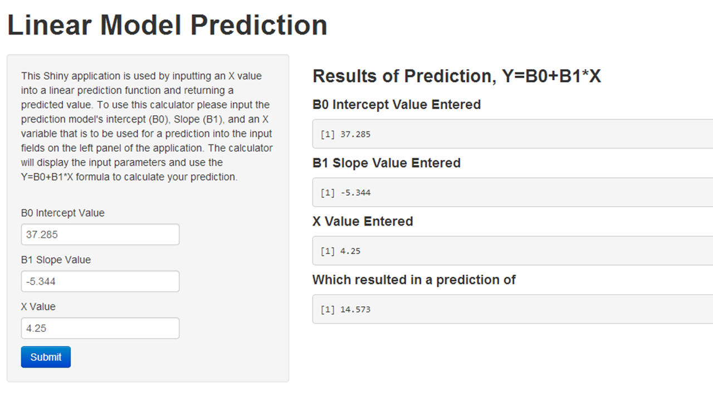

Developing Data Products, Shiny App
========================================================
author:Tamdem Z
date: 05/23/2015
transition: rotate


Purpose and Objective
========================================================
transition: rotate

The purpose of this presentation is to demonstrate and discuss the Predictive Model App that was built in Shiny for the Developing Data Products Coursera class.

The objective of this R presentation is to have a user understand the Shiny App and be able to use it when they want to derive a predicted value.

What is the Prediction Model App?
========================================================
transition: rotate

The Prediction Model App is used to determine a predicted value once a linear model formula has been identified. The App uses the Y = B0 + B1 * x formula for the calculation.

A user enters the slope, intercept, and an x value for the model to provide a simple linear prediction value. The predicted value is then displayed along with the inputs the user entered into the App.

The Shinny App can be accessed by clicking on this link http://tamdemz.shinyapps.io/linear/


Example of Linear Model for App.
========================================================
transition: rotate

```{r, eval=FALSE}
data(mtcars)
modelFit <- lm(mpg ~ wt, data = mtcars)
modelFit$coefficients
```

```{r, eval=FALSE, echo=FALSE}
(Intercept)          wt 
     37.285      -5.344 
```

Here the model indicates that for every 1 unit increase in weight there will be a -5.344 decrease in MPG.

Using the model's coefficients, the shiny app will provide predictions for a vehicle's MPG given a vehicles weight provided by the user.


How to use the App
========================================================
transition: rotate

Using the Intercept of 37.285 and Slope of -5.344 we can determine a prediction of 14.573 MPG for a vehicle that weighs 4,250lbs.The App can display several predictions! 



